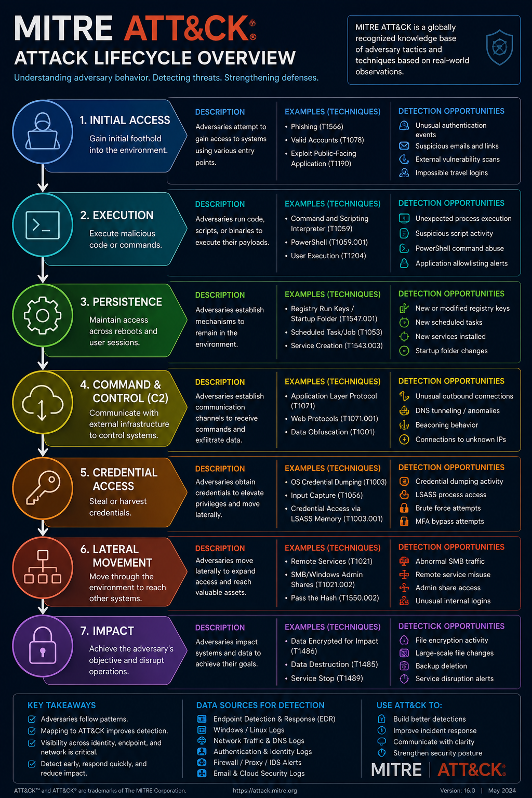

# Regional Cyber Threat Analysis: Chelan & Okanogan County Incidents

## Overview

This project provides a defensive cybersecurity analysis of publicly reported cyber incidents affecting organizations in North Central Washington.

The goal of this research is to examine regional cyber threats, identify common attacker behaviors, map potential activity to the MITRE ATT&CK framework, and identify detection opportunities from a Security Operations Center (SOC) perspective.

This analysis does not attempt to attribute attacks or confirm unverified attacker activity. It focuses on defensive analysis based on publicly available information.

---

# Incident Analysis

## Chelan County Malware Incident (2026)

## Publicly Reported Information

Public reporting identified a malware-related cybersecurity incident affecting Chelan County systems.

Reported response actions included:

- Network systems being taken offline as a containment measure
- Investigation of affected systems
- Restoration efforts with cybersecurity support

The incident resulted in operational disruption and required coordinated recovery efforts.

---

## Confirmed Information

Confirmed:

- Malware activity affected county systems
- Operational disruption occurred
- Recovery efforts were initiated
- Security investigation activities were conducted

---

## Not Publicly Confirmed

The following details have not been publicly confirmed:

- Initial access method
- Specific malware family
- Threat actor identity
- Command-and-control infrastructure
- Lateral movement techniques
- Full attacker timeline

---

# Defensive Analysis

Because the complete attack chain has not been publicly released, a SOC analyst would investigate common malware and ransomware behaviors using available security telemetry.

Areas of investigation would include:

## Initial Access

Analyst questions:

- Was access gained through phishing?
- Were compromised credentials involved?
- Was an external-facing vulnerability exploited?

---

## Endpoint Activity

Investigation areas:

- Suspicious process execution
- Malware discovery
- Persistence mechanisms
- Unusual user activity

---

## Command and Control

Potential indicators:

- Unusual outbound connections
- Suspicious DNS activity
- Unknown external infrastructure
- Beacon-like communication patterns

---

## Credential and Lateral Movement Investigation

Analysts would review:

- Privileged account activity
- Remote service usage
- SMB activity
- Authentication anomalies

---

# Okanogan County Cyber Incidents

## 2021 Denial-of-Service Incident

Public reporting identified a denial-of-service incident affecting Okanogan County services.

### Reported Impact

- Disruption of public-facing services
- Availability issues affecting county systems

### Attack Category

- Denial of Service (DoS)

### Defensive Considerations

A SOC team monitoring for denial-of-service activity would focus on:

- Unusual traffic volume
- Network availability monitoring
- Service degradation patterns
- External source analysis

---

# 2026 Qilin Ransomware Incident

Public threat intelligence reporting identified Okanogan County Vets as a ransomware victim claimed by the Qilin ransomware group.

## Reported Characteristics

- Ransomware/extortion activity
- Threat of data disclosure
- Criminal ransomware group involvement

---

## Analyst Note

Threat actor claims should be validated independently whenever possible.

Ransomware leak site claims may provide limited technical information about:

- Initial access
- Malware deployment
- Attacker timeline
- Internal movement
- Data access methods

This analysis treats public reporting as threat intelligence input rather than confirmed forensic evidence.

---

# Regional Threat Patterns

Based on reviewed incidents, several recurring cybersecurity themes were identified:

| Threat Category | Example |
|---|---|
| Malware | Chelan County incident |
| Ransomware | Qilin ransomware claim |
| Denial of Service | Okanogan County 2021 incident |
| Phishing | Common initial access method |
| Unauthorized Access | Common enterprise security risk |

---

# Common Ransomware Attack Lifecycle

Many ransomware incidents follow a similar progression.

**Important:** The following represents a common defensive model and does not represent a confirmed timeline for the incidents analyzed.

| Attack Phase | SOC Investigation Focus |
|---|---|
| Initial Access | Phishing, stolen credentials, exposed services |
| Execution | Malicious processes, scripts, and binaries |
| Persistence | Registry keys, scheduled tasks, services |
| Command and Control | DNS activity, outbound connections, beaconing |
| Credential Access | Credential dumping, password theft |
| Lateral Movement | SMB, remote services, administrative tools |
| Impact | Encryption, destruction, service disruption |

Security teams investigate each phase using endpoint, identity, and network telemetry to identify attacker behavior before significant impact occurs.

---

# MITRE ATT&CK Lifecycle Overview

The MITRE ATT&CK framework provides a common language for describing adversary behavior and helps defenders map observed activity to known attacker techniques.

---

# SOC Analyst Perspective

A Security Operations Center analyst investigating similar incidents would examine multiple data sources.

## Identity Monitoring

Analyst questions:

- Were compromised accounts used?
- Did privileged accounts behave unexpectedly?
- Were unusual authentication events observed?

---

## Endpoint Monitoring

Analyst questions:

- What process executed first?
- Were suspicious files introduced?
- Did malware spread between systems?

---

## Network Monitoring

Analyst questions:

- Were unusual outbound connections observed?
- Was command-and-control communication present?
- Did internal systems communicate abnormally?

---

# Key Takeaways

This research reinforces the importance of:

- Centralized logging
- Endpoint visibility
- Network monitoring
- Identity protection
- Threat intelligence
- MITRE ATT&CK knowledge

Effective defenders focus on detecting attacker behavior through available telemetry rather than relying only on threat actor identification.

---

# Skills Demonstrated

- Threat intelligence research
- Cyber incident analysis
- MITRE ATT&CK mapping
- SOC investigation methodology
- Detection engineering concepts
- Defensive security analysis

---

# Analyst Connection

This project aligns with my cybersecurity training through PISCES network monitoring and my HELM Elastic SIEM home lab, where I have focused on improving network visibility, security monitoring, and detection opportunities.
